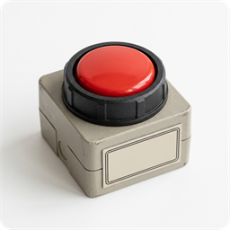
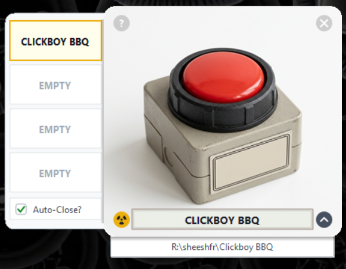

<div align="center">
  
  <h1>AZ-5 Button</h1>
</div>

<div align="center">
  
  <a href="LICENSE"></a>

  <p>A tactile, retro-styled emergency SCRAM button quick launcher for your favorite game, script, or desktop application. Slam the button to launch!</p>
  <p>Vibe Coded by <a href="https://github.com/sheeshfr"><b>SheeshFr</b></a></p>

  <br />

  
</div>

---

## Overview

A tactile, retro-styled emergency SCRAM button quick launcher for Windows. Click the big red button to immediately launch your favorite game, application, script, or folder.

---

## How to Use

1. **Slam the Button**: Click the big red industrial button to immediately launch your active target!
2. **Switch Targets (Radiation Button)**:
   - Click the radioactive glyph (bottom-left) to reveal the quick target drawer.
   - Switch between **4 target slots** with a single click.
3. **Inspect Target Path (Arrow Button)**:
   - Click the arrow button (bottom-right) to slide out the current target path.
4. **Configure Target**:
   - Right-click anywhere on the button or click **`?`** (top-left) to open controls.
   - Assign any **executable (`.exe`)**, **game shortcut**, **script**, or **folder**.
   - Custom label naming with automatic clean abbreviation on the vintage casing badge.
5. **Auto-Close Mode**:
   - Toggle **`Auto-Close?`** in the left drawer or right-click menu.
   - When checked, the launcher automatically exits after launching your target. When unchecked, it stays open for repeated slamming!

---

## Download

Grab the latest ready-to-run **`AZ-5_Button_Release.zip`** from [**Releases**](https://github.com/sheeshfr/AZ-5_Button/releases/latest). Unzip and run!

---

## Building from Source

No external dependencies or SDK installs required. Built with pure .NET Framework 4.0 and Windows GDI+:

1. Open PowerShell in the project directory.
2. Run the compilation script:
   ```powershell
   .\compile.ps1
   ```
3. A standalone executable (`AZ-5 Button.exe`) will be generated with embedded resources and application icon.

---

## License

This project is licensed under the [GNU General Public License v3.0](LICENSE).
